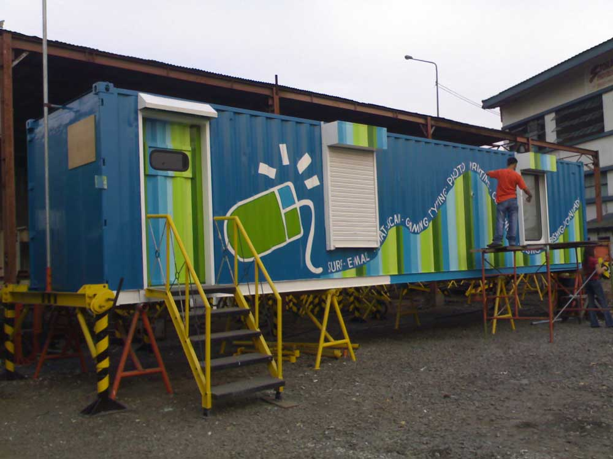
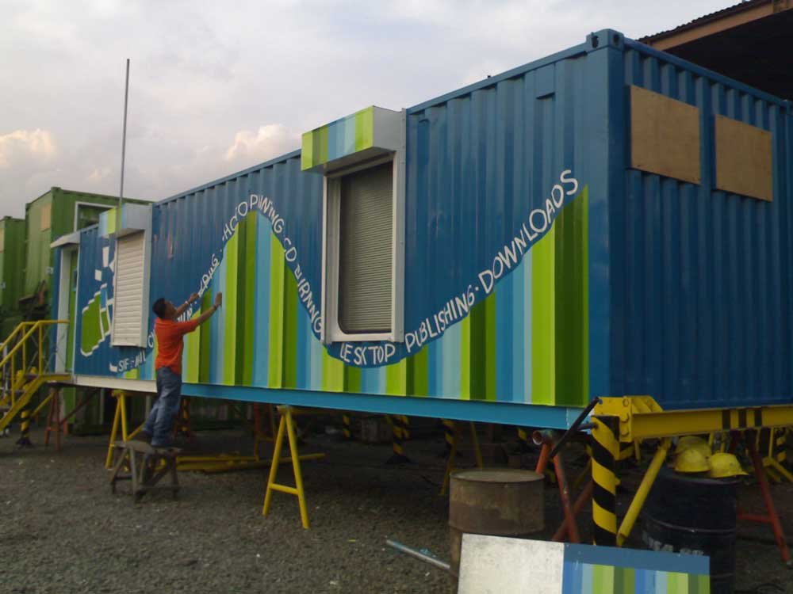
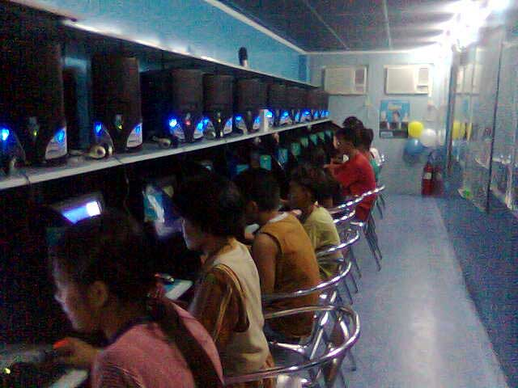
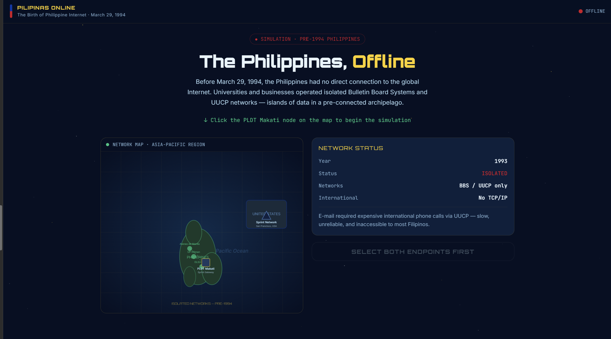
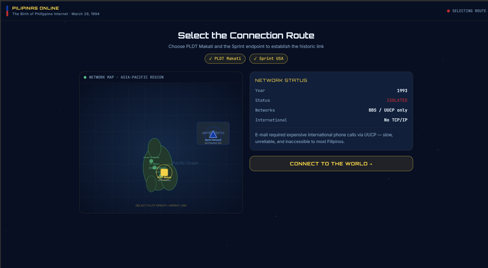
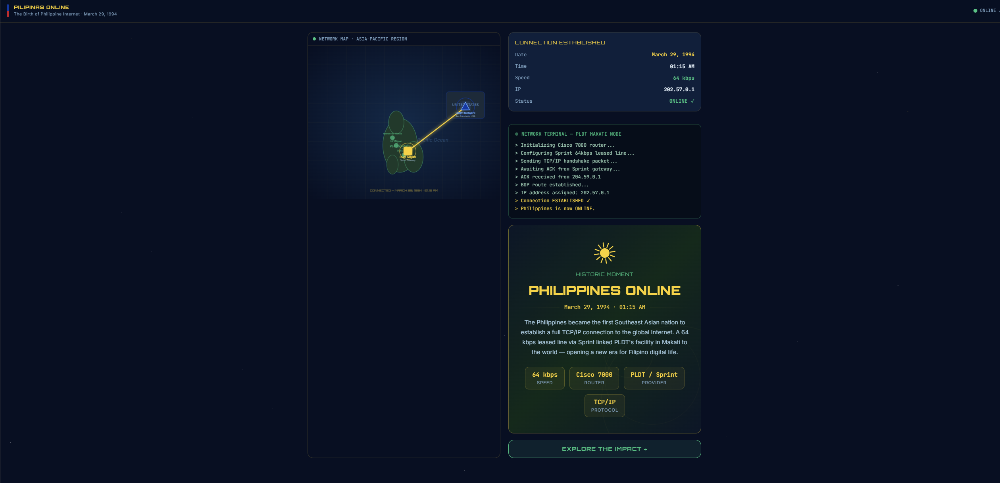
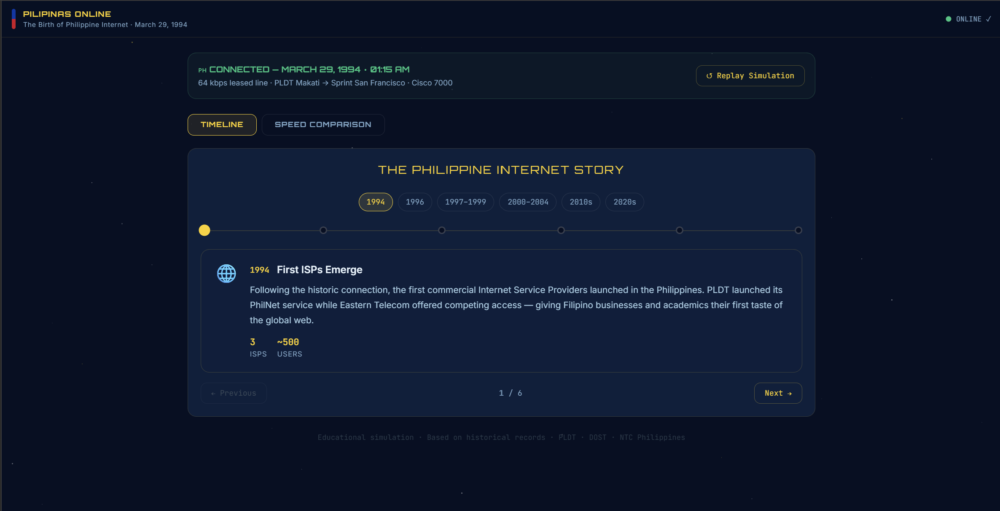
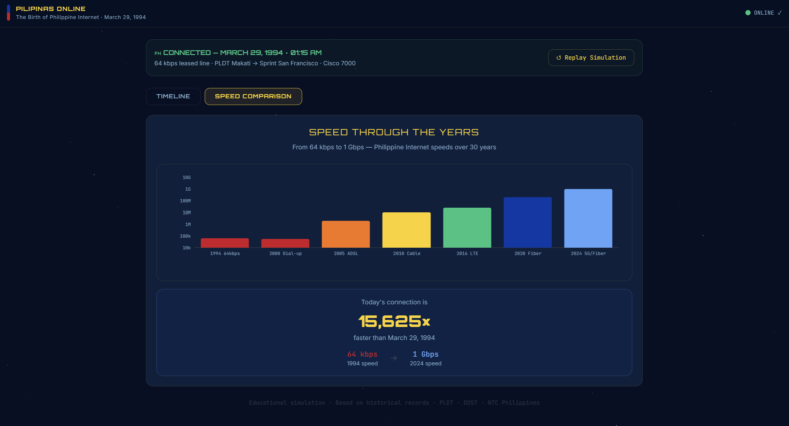

# CSARCH2 Virtual Exhibit Case Study Proposal
### 3rd Term AY 2025-2026
---
**S05 Group 9**

**GitHub Repository Link:** [https://github.com/tartar121/CSARCH2-CASESTUDY](https://github.com/tartar121/CSARCH2-CASESTUDY)

### Members
| Name | GitHub |
| :--- | :--- |
| Dabuit, Daniel Jedrick C. | [@danueli](https://github.com/danueli) |
| Go, John William D. | [@johnwilliam-go](https://github.com/johnwilliam-go) |
| Liwanag, Ram Miguel C. | [@Rammy-errorlol](https://github.com/Rammy-errorlol) |
| Lobo, Shirley Marie A. | [@SAM-lvl1](https://github.com/SAM-lvl1) |
| Uy, Tara Ysabel P. | [@tartar121](https://github.com/tartar121) |
---
### Project Overview
* **Category:** Historical Computing
* **Topic Theme:** Computing in the Philippines - Local Tech History
* **Project Title:** *Kumusta Mundo: Ang Kaarawan ng Lokal Networks sa Pilipinas*

### Historical Context & Exhibit Discussion:
Instead of just repeating the usual Western-centric history of the internet like ARPANET or the World Wide Web, our exhibit focuses on a major milestone right here in the Philippines: **March 29, 1994, at 1:15 AM**.

At this exact time, local tech pioneers successfully linked a Cisco 7000 router from a PLDT facility in Makati to a 64 kbps Sprint link in the US, which officially marked the birth of the Philippine internet. Our project will look into the actual hardware challenges faced by the multi-institutional Philnet project, how local computer networks moved away from isolated Bulletin Board Systems (BBS), and how these early infrastructure decisions shaped the country's digital setup today.

### Tech Stack Plan
To ensure seamless integration into the central museum website platform, our development stack adheres strictly to the required core versions:
* **Environment Execution:** Node.js 26 (Major version requirement)
* **Framework Architecture:** Astro 6 (Forked from the provided template repository)
* **Content Engine:** MDX (Markdown Extended) for embedding structured interactive elements into documentation pages
* **Interactive State Engine:** React (`.jsx` / `.tsx` functional components) paired with TypeScript to safely handle state variables, console input logs, and audio cues
* **Styling Engine:** Tailwind CSS for fast utility rendering and responsive viewport fluid design

#### Proposed Interactive Element (Detailed Compatibility Specification)

* **Component Name:** *(Smart) Internet Cafe*
* **Central Website Compatibility Context:** This feature is built using Three.js and JavaScript and embedded within the Astro-based exhibit as an interactive React component. The experience utilizes a 3D model created in Blender, allowing visitors to freely explore a virtual reconstruction of a Smart Internet Café deployment unit. The model is based on publicly documented Smart Communications and Storage Providers Inc. mobile Internet café initiatives and includes both the exterior and interior layouts of the storage van alongside an interpreted networking setup.

Sample Images:

**Front**

**Back**

**Inside**

* All assets are rendered client-side, eliminating the need for external APIs or backend services and ensuring compatibility with the central virtual museum website. The component is designed to support desktop and mobile devices while maintaining smooth performance through optimized 3D assets and responsive controls.

### Step-by-Step User Flow & Functionality Plan:
#### 1. Initial State — The Offline Philippines
Users are introduced to a visual representation of the Philippines' early computer network environment before 1994. The interface displays isolated local networks and Bulletin Board Systems (BBS) that operated independently without a direct connection to the global Internet. A short historical introduction provides context on the limitations of digital communication during this period.

#### 2. Selecting the Connection Route
Users interact with a network map by selecting the PLDT facility in Makati and the Sprint network endpoint in the United States. The simulation highlights the international connection route that would eventually link the Philippines to the global Internet.

#### 3. Establishing the Link
Users initiate the historical connection by pressing the **"Connect to the World"** button. An animated data packet travels through the Cisco 7000 router and across the 64 kbps Sprint connection. Audio cues and visual feedback simulate the process of a successful network initialization.

#### 4. The Historic Moment — March 29, 1994, 1:15 AM
Once the connection is successfully established, the interface transitions into a commemorative scene marking the Philippines' first official connection to the Internet. A timeline marker appears to emphasize the historical significance of March 29, 1994, at 1:15 AM.

#### 5. Exploring the Impact
Users can explore interactive timeline cards that showcase the developments following the birth of the Philippine Internet, including:
* The emergence and growth of Internet Service Providers (ISPs)
* The expansion of national Internet infrastructure
* The rise of online communities and digital communication
* The transition to modern broadband and mobile Internet technologies

#### 6. Replay & Compare
Users may restart the simulation to experience the historic connection process again. An optional comparison feature allows users to compare the original 64 kbps connection with modern Internet speeds, illustrating the technological progress of the Philippines' digital infrastructure.

---
## Mobile-Responsive Layout Plan
* **Desktop Layout Configuration**: The structure of the exhibit uses a side-by-side layout with the text content on the left and a sticky interactive simulation on the right. This guides the user through the Philippine Internet connection timeline in a continuous flow.

* **Tablet Layout Behavior**: The desktop layout configuration will be used for the landscape orientation of the tablet, while the mobile layout will be utilized for the portrait orientation of the tablet.

* **Mobile Layout Structure**: The elements of the exhibit will follow a single column layout which is perfectly designed for smartphones. The interactive simulation is positioned as a sticky element within the layout, remaining visible alongside the scrolling content that guides the user throughout the exhibit.

* **Responsive Navigation Design**: For desktop layout, a sticky navigation bar will be implemented to provide quick access to major sections of the exhibit. As for the mobile layout, a collapsible menu is used to save space for the other elements of the exhibit.

* **Media and Interactive Component Scaling**: The webpage will have a responsive layout where it adapts smoothly to different screen sizes. This ensures consistent readability, proportional scaling, and usability across all screen sizes.

* **Accessibility Considerations**: During the development of the exhibit, the sizes of text and clickable elements (if any), will be adjusted until it's comfortably readable and touch-friendly for the user. Lastly, the spacing of each element shall be adjusted until all content is visually balanced, ensuring an intuitive user experience across all devices.
---
## Style Guide Snapshot – Proposed Virtual Exhibit Design Layout

Interactive 3D Model: https://app.spline.design/file/8426f53a-b09e-41ed-9bab-772b7301aba4

Figma Representation: https://www.figma.com/make/oOeB9LGiYgIPHvvayizKVZ/Interactive-Internet-History-Simulation?t=XEQHxV9rSlF7AfFR-0

**Disclaimer**: The visualizations provided is AI generated using the Figma AI Website Generator for the website and Meshy AI 3D generator for the (Smart) Internet Cafe. This representation will only be used for the proposal stage of the project

---
## References
* [The Urban Roamer: Internet in the Philippines - 20 Years Online](https://www.theurbanroamer.com/internet-in-the-philippines-20-years-online/)
* [The Ayson Chronicles: The Night Benjie Tan Hooked up the Philippines to the Internet](https://jimayson.wordpress.com/2011/08/13/the-night-benjie-hooked-up-the-philippines-to-the-internet/)
* [PhilStar: 'Broadbanding the Country Side'](https://www.philstar.com/business/telecoms/2006/07/08/346240/smart-click-145broadbanding146-countryside?fbclid=IwY2xjawSfOLlleHRuA2FlbQIxMABicmlkETFMT2Z6c3V5TjhqTDNLRnR5c3J0YwZhcHBfaWQQMjIyMDM5MTc4ODIwMDg5MgABHtJRUukgaUhJPYIBIoHdc4-gt6I1jg4wDjodWU2OGsFGzjE6k8XaWxFvxSqj_aem_eTz5VuNknJzzfyG3-DEvGA)
* [Storage Providers Inc - Smart Communications Inc. Internet Cafe](https://storageproviders.ph/smart-communications-inc/?fbclid=IwY2xjawSfOO1leHRuA2FlbQIxMABicmlkETFMT2Z6c3V5TjhqTDNLRnR5c3J0YwZhcHBfaWQQMjIyMDM5MTc4ODIwMDg5MgABHtJRUukgaUhJPYIBIoHdc4-gt6I1jg4wDjodWU2OGsFGzjE6k8XaWxFvxSqj_aem_eTz5VuNknJzzfyG3-DEvGA)

> **Note:** This repository serves as the initial proposal and development hub for Group 9's virtual museum exhibit page. All documentation, incremental plans, and component files will be managed here. The details outlined herein are subject to change prior to final submission.
